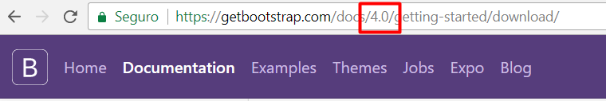
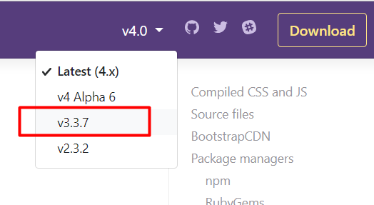

# 2.2 IMPORTANTE: v3 vs v4 {docsify-ignore-all}

**Bootstrap 3 vs Bootstrap 4**

A principios de 2018 Bootstrap sacó una versión nueva de su código (v4), que tiene algunos cambios menores respecto de su versión anterior (v3). Debido a que esta nueva versión aún es reciente, vamos a aprender la versión 3 ya que es más estable y todavía es enormemente utilizada para construir miles de sitios.

Como comentamos en la sección anterior, vamos a usar la versión 3 de bootstrap. Es posible que por default el sitio te lleve a la versión 4, así que asegurate de chequear que en la URL diga 3 en vez de 4:

Si estás usando la versión 4 podés cambiarte a la 3 usando el botón que está a la derecha de la barra de navegación:

