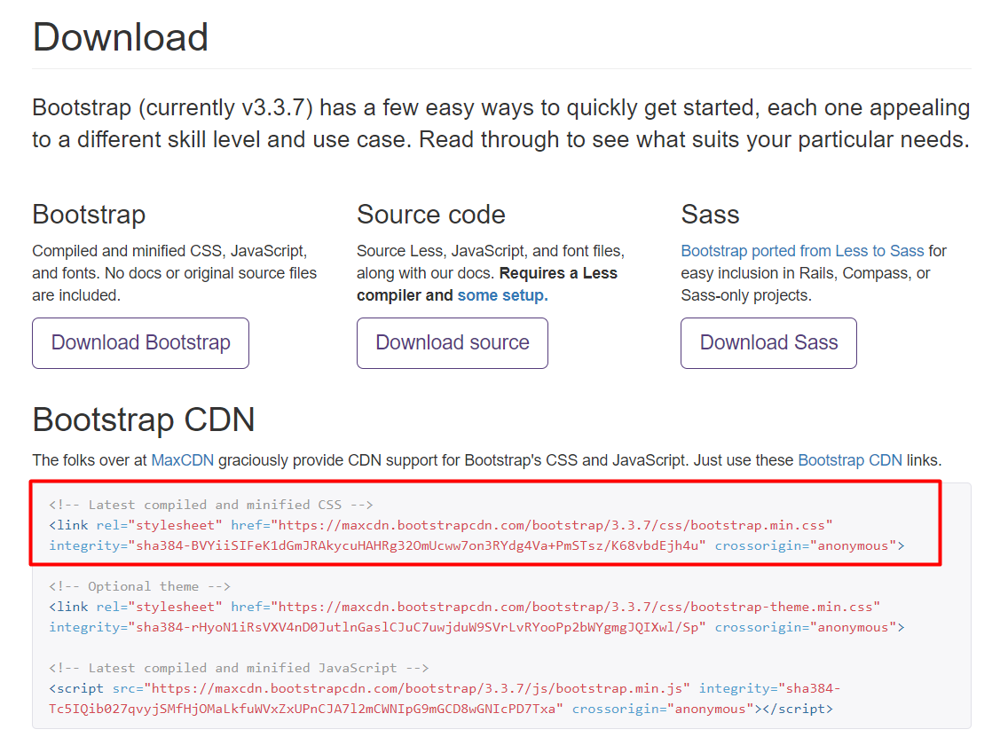

# 2.3 Agregando Bootstrap a nuestro sitio {docsify-ignore-all}

Vayamos a la homepage de Bootstrap y hagamos click en "Download Bootstrap". Tenemos dos alternativas para agregar Bootstrap a nuestro proyecto:

  * Descargando Bootstrap a nuestra computadora
  * Trayendo Bootstrap desde internet usando un CDN

**1) Descargando Bootstrap a nuestra computadora:**

Podemos bajar los la hoja de estilos de bootstrap a nuestra computadora y usarla igual que lo hacíamos con nuestras propias stylesheets. Para esto hacé click en la opción que dice "Download Bootstrap". En el archivo que descargaste hay 3 carpetas, vamos a ir a la que se llama "CSS", y una vez ahí el archivo que vamos a usar es el que se llama **bootstrap.css**. Los demás archivos son variantes que no nos interesan.

Andá hasta el final del archivo y mirá todas las líneas de código que tiene, ¡MILES!. Imaginá tener que escribir todo eso, suerte que alguien ya lo hizo por nosotros. Si mirás con atención vas a ver que la mayoría de las cosas son definiciones de clases y variantes con pseudo-selectores (ej: ".label", ".glyphicon-inbox:before", etc.). Cuando usemos los componentes de bootstrap vamos a estar asignandole clases a los elementos html todo el tiempo, que les dan la forma y la estética que dice este archivo "bootstrap.css".

Ahora sí, vamos a aplicar Bootstrap a una página:

  * Creá un html nuevo que tenga un h1 que diga "Bienvenido a Bootstrap" y guardalo en una carpeta nueva
  * Copiá el archivo "bootstrap.css" que acabás de bajar y pegalo en la carpeta con el html nuevo
  * Abrí el html y mirá el estilo de la letra (va a cambiar cuando conectemos Bootstrap)
  * Dentro del head del html, creá un tag link, con el atributo rel="stylesheet" y href="bootstrap.css" (el archivo que acabamos de pegar en la carpeta)
  * Guardá los cambios y recargá la página. Si cambió la tipografía ya tenés bootstrap funcionando :) (entre otras cosas, Bootstrap te da un estilo de tipografía default nuevo)

**2) Trayendo "bootstrap.css" desde internet:**

Vimos que el tag link nos permitía vincular un html tanto a un archivo local de nuestra compu (ej. el bootstrap.css que acabamos de bajar) como a hojas de estilo en internet, como habíamos hecho con Google Fonts. Por suerte el archivo de Bootstrap también está disponible online, con lo que no necesitamos bajarlo a nuestra máquina para usarlo.

Si volvemos a la sección [Getting started](https://getbootstrap.com/docs/3.3/getting-started/) vemos que después de Download hay un título que dice "Bootstrap CDN".

Un CDN (Content Delivery Network) es un servicio que ofrece contenido en internet, y que en este caso es usado para hacernos llegar el archivo de Bootstrap.

Para usarlo simplemente:

  * Copiá el primero de los tres link tags que figura en el recuadro de la sección Bootstrap CDN (es el que está debajo del comentario que dice "Latest compiled and minified CSS").
  * Pegá el link tag en el html que habías creado, reemplazando al link tag anterior
  * Guardá y recargá. No deberías notar ningún cambio, la única diferencia es que ahora en vez de usar Bootstrap desde el archivo local lo estamos trayendo desde internet.

Algunos detalles:

  * Los atributos "integrity=" y "crossorigin=" del link tag que acabamos de copiar no son obligatorios. De hecho si en el link tag anterior reemplazabas "bootstrap.css" por la dirección que está dentro del atributo "href=" del tag nuevo, funcionaba igual. Podés probarlo.
  * Entrá a la dirección que está dentro del atributo "href=https://maxcdn.bootstrapcdn.com/bootstrap/3.3.7/css/bootstrap.min.css", vas a ver que es el mismo archivo minificado que bajaste a tu compu pero subido a internet.
  * Si en esa url borrás la parte de ".min", dejando [https://maxcdn.bootstrapcdn.com/bootstrap/3.3.7/css/bootstrap.css](https://maxcdn.bootstrapcdn.com/bootstrap/3.3.7/css/bootstrap.css) , vas a ver que es exactamente el mismo archivo que estábamos usando localmente.
