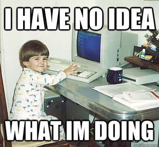

# 3.1 La documentación: nuestra guía {docsify-ignore-all}

En sus secciones [CSS](https://getbootstrap.com/docs/3.3/css/) y [Components](https://getbootstrap.com/docs/3.3/components/), el sitio de Bootstrap contiene todos los componentes que vamos a usar para nuestras páginas: botones, formularios, barras de navegación, contenedores de imágenes, etc, etc.

**En cada componente vamos a encontrar su código correspondiente**, y lo único que tenemos que hacer para usarlo es copiarlo y pegarlo en nuestro html (una vez que tenemos agregado el archivo de bootstrap). La mejor forma de usar bootstrap entonces es entrar a la documentación, hacer "Ctrl+f" ("Cmd+f" en mac) para abrir el buscador de la página, y escribir lo que estamos buscando.

Piensen a Bootstrap como un **menú de componentes del cual agarramos los que queremos**, los incluimos en nuestro sitio y los modificamos un poco para adaptarlos a gusto.

**IMPORTANTE: NO TE FRUSTRES SI SENTÍS QUE HAY DEMASIADO CÓDIGO QUE NO ENTENDÉS**

(vos ahora)

Una habilidad fundamental de un programador es la de IGNORAR LA COMPLEJIDAD. Esto quiere decir ignorar todo lo que no entendés y enfocarte en conseguir lo que necesitas. Siempre van a haber miles de cosas que no entendés y nunca vas a poder saber todo, así que mejor ir entendiendo las cosas que vas necesitando, para aprender paso a paso.

Con el tiempo vas a ir internalizando el código y se te va a hacer mucho más natural, pero es muy importante no desesperarse por tratar de entender todo. Si tratás de entender todo de entrada te vas a ahogar; si te concentrás en ir aprendiendo lo que necesitas te vas a ir abriendo camino.

Acordate que para volverte programador no tenés que ser experto en memorizar, tenés que ser experto en saber buscar la información que necesitás.