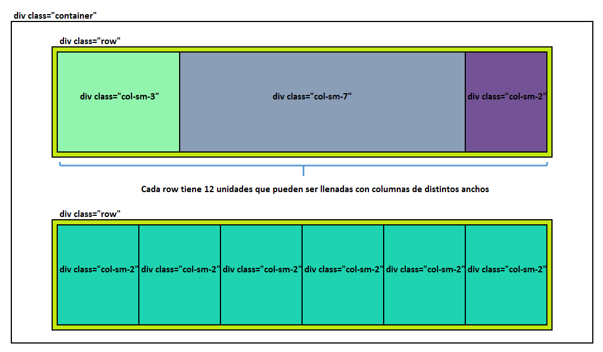

# 4.1 El Grid System {docsify-ignore-all}

Llegamos al punto tal vez más importante de Bootstrap: el **Grid System**. El grid system es probablemente la razón principal por la cual la gente usa Bootstrap, ya que nos ayuda a armar el layout de una página fácilmente, evitándonos tener que lidiar con las reglas de posicionamiento CSS que como vimos pueden ser muy complicadas.

Como su nombre lo indica, el grid system es simplemente **una grilla, compuesta por filas y columnas** que nos ayuda a colocar nuestro contenido. Vamos a dividir nuestras páginas en filas horizontales usando divs con clase row ( ```<div class="row">``` que en adelante llamaremos rows), y luego subdividir cada row en columnas de distintos anchos usando divs con distintas clases según el ancho de la columna, ej. ```<div class="col-sm-4">```, ```<div class="col-sm-8">```, etc (en adelante las llamaremos columns). Para que el grid system funcione, las rows y las columns tienen que estar dentro de un ```<div class=container>```.

# Haciendo una grilla
  
  * Colocamos un ```<div class="container">```.

  * Dentro del container ponemos las rows que querramos, usando ```<div class="row">```.

  * Dentro de las rows ponemos columnas, usando divs con distintas clases según el ancho de la columna que queremos, ej. ```<div class="col-sm-6">```, ```<div class="col-sm-4">```, ```<div class="col-sm-2">```.

# CLAVE: cada row se divide en 12 unidades

Cada row se divide en 12 unidades y cada columna puede tener un ancho de 1 a 12 unidades. Los anchos de las columnas deben sumar 12 unidades por row, y podemos combinarlas en anchos diferentes. Es decir, dentro de una row podríamos tener una única columna de 12 unidades, o 2 columnas de 6 unidades, o 4 columnas de 3 unidades, o cualquier combinación de columnas que sumen 12 unidades. Por ejemplo, una row podría estar dividida en una columna de 2, una de 4, otra de 4 y otra de 2 unidades, sumando 12 en total. Importante: **las unidades son una medida de proporción independiente del tamaño de la row**. Tanto una row grande como una row chiquita (ya vamos a ver el tema de los tamaños) se subdividen en 12 "partes" que son ocupadas por columnas.



