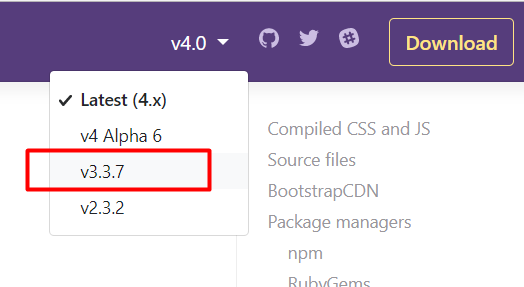

# 1.1 Objetivos {docsify-ignore-all}

El trabajo de un programador front-end muchas veces se trata de pasar a código el diseño de otros, a esto se le llama **maquetar**. Básicamente recibimos un archivo de un diseñador que nos muestra cómo se tiene que ver una página, y nuestro trabajo es replicarlo usando HTML y CSS logrando que se vea exactamente igual.

En este primer hackaton vamos a maquetar un sitio de e-commerce (una "tienda web" o "webstore"), basándonos en las imágenes que están más abajo. Para lograr esto vamos a utilizar gran parte de lo que aprendimos esta semana.

Vamos a utilizar Bootstrap para hacer este sitio. Esto nos va a permitir codear más rápido y asegurar una base estética. **IMPORTANTE**: fijhate que la versión de Bootstrap que estés usando sea la 3.3.7. Esto podés chequearlo en la barra de navegación de la página de bootstrap.

Asegurate de terminar este hackaton porque en el siguiente vamos a continuar desde donde terminamos acá. En este hacemos el maquetado (el diseño estético replicando las imágenes de referencia) y en el próximo le agregaremos funcionalidades avanzadas usando JavaScript. Pero por hoy nos enfocamos solamente en la vista.