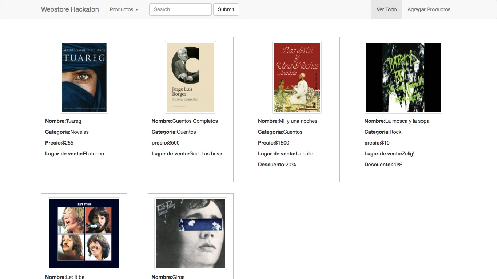

# 3.1 Ver todo {docsify-ignore-all}

A las págnas de un sitio se las llama "vistas". En adelante vamos a ir viendo las vistas que tiene que tener tu web store, que vas a tener que ir replicando en tu código a partir de las imágenes que te mostramos.

